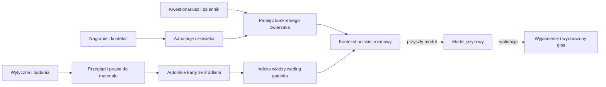

# Architektura i kontrakty danych

Pierwszy działający moduł to biblioteka Python i CLI z SQLite. Publiczna wiedza jest oddzielona
od prywatnej pamięci pojedynczego użytkownika. Uruchomienie nie wysyła danych do zewnętrznego modelu.

## Działające moduły

- `copowiesz/core.py`: walidacja źródeł/kart, budowa odtwarzalnego indeksu FTS5, wyszukiwanie
  z filtrem gatunku, pamięć zapisów, wersje profilu opisowego i usuwanie zwierzaka z tej pamięci.
- `copowiesz/__main__.py`: lokalne komendy. `prepare-context` przygotowuje dane do późniejszego
  modelu; nie wykonuje połączenia z LLM.
- `scripts/fetch_literature.py`: ręczny import wybranych metadanych Europe PMC lub Crossref.
  Importy są kandydatami do przeglądu, nie dowodami automatycznie dopuszczonymi do odpowiedzi.

## Rekord obserwacji

Wymaga `pet_id`, opisu `behavior`, `context`, czasu ze strefą oraz rodzaju pochodzenia:
`owner_report`, `human_video_annotation` albo `clinician_note`. Adnotacje i notatki wymagają
referencji do dowodu, ale CLI nie sprawdza kwalifikacji autora ani istnienia zewnętrznego nagrania.
Dlatego wszystkie wpisy mają `provenance_status=unverified`. W produkcji potrzebna jest osobna
tożsamość autora, podpis oceny, dostęp do materiału oraz mechanizm korekt i audytu.

Pamięć opisowa agreguje liczbę zapisów tekstu zachowania. Nie normalizuje synonimów,
nie zna liczby okazji i nie mierzy rozpowszechnienia tego zachowania. Nie ma skali osobowości.

## Docelowe encje chmurowe

`owners`, `pets`, `pet_memberships`, `consents`, `video_assets`, `observation_sessions`,
`observations`, `annotation_revisions`, `questionnaire_versions`, `questionnaire_responses`,
`trait_hypotheses`, `profile_versions`, `knowledge_sources`, `knowledge_cards`, `retrieval_runs`,
`conversation_turns`, `model_runs`, `deletion_jobs`, `audit_events`.

Każdy zapis prywatny ma właściciela/profil, czas, wersję schematu i pochodzenie. Hipoteza cechy
ma listę wspierających i przeczących obserwacji, zakres kontekstów oraz status przeglądu.
Wynik modelu ma wersję modelu, konfigurację, identyfikatory wejść i ograniczenia pomiaru.
Szkielet kontraktu jest w `schemas/observation.schema.json`; walidacja CLI dotyczy wdrożonych pól.

## Dalsze komponenty

Backend aplikacji może użyć PostgreSQL/Supabase: autoryzacja per opiekun i członkostwo,
prywatny magazyn plików, krótkie podpisane linki, kolejka zadań wideo i wersje dokumentów.
Filtrowanie gatunku i właściciela odbywa się przed wyszukiwaniem i generacją.
Embeddingi można dodać po stworzeniu zestawu pytań oceniającego wyszukiwanie po polsku;
obecny FTS5 jest wyszukiwaniem leksykalnym, bez rozumienia odmiany ani pełnych synonimów.

Moduł wideo najpierw mierzy zdarzenia obserwowalne: obecność, ruch, punkty ciała,
czas trwania, odległość względną. Stan emocjonalny pozostaje hipotezą z kontekstem.
Nie inferujemy tożsamości zwierzaka pomiędzy filmami na podstawie samego trackera.

## Prywatność w obecnym prototypie

Baza pamięci ma uprawnienia pliku 0600, lecz pozostaje niezaszyfrowana i przeznaczona dla
jednego lokalnego użytkownika. Nie ma jeszcze kont, RLS, backupów ani logowania audytowego.
Usunięcie profilu usuwa powiązane wiersze obserwacji i wersji. SQLite używa `secure_delete=ON`,
co w testach usuwa tekst obserwacji i snapshotów również z aktywnego pliku bazy. Eksporty i oryginalne nagrania
w innych lokalizacjach wymagają osobnego usunięcia. Nie umieszczaj prawdziwych danych w przykładach.

Przed przetwarzaniem osób widocznych/słyszalnych w nagraniach trzeba ustalić podstawę
przetwarzania, zakres zgód, czas retencji i dostawców. To wymaganie projektu do realizacji,
nie potwierdzenie zgodności prawnej gotowego systemu.
